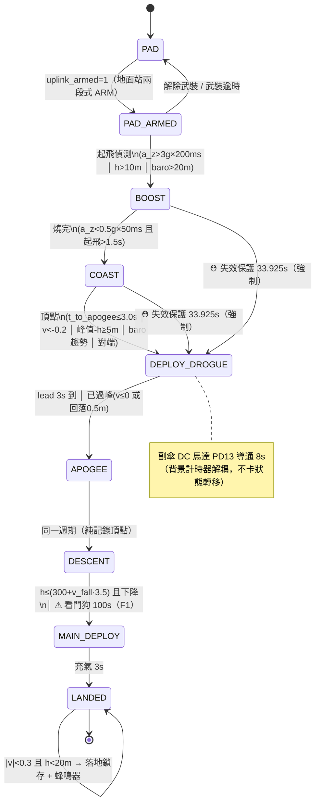
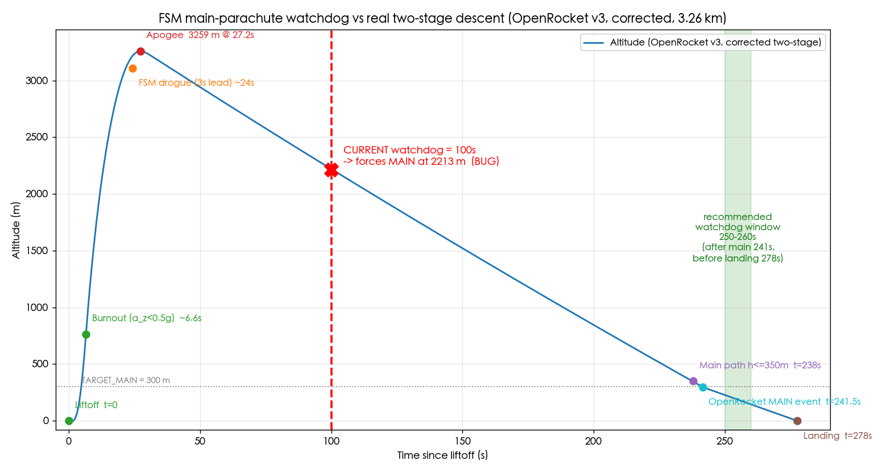

# FSM 飛行狀態機統整 × OpenRocket 對照 × 安全審查

> **文件性質**：飛行回收邏輯的完整統整與安全審查。逐狀態說明「轉移時機／觸發條件／設計理由」，
> 對照 OpenRocket 模擬（`simulation_and_data/flight_data/`）指出可能調整。
> **本文件不修改任何飛控程式碼**——僅分析與建議，實際是否採納由飛行團隊決定。
> **唯一真實來源**：[`fsm.c`](../firmware/main_flight_code/Core/Src/fsm.c) ＋
> [`fsm.h`](../firmware/main_flight_code/Core/Inc/fsm.h)；硬體接線於
> [`main.c:FSM_Update`](../firmware/main_flight_code/Core/Src/main.c)（約 1876 行）。
> 日期：2026-07-25（v3 資料更新）　範圍：飛行 profile（`FLIGHT_PROFILE_ELEVATOR=0`）。
> **資料來源已改用 `simulation_and_data/flight_data/v3.csv`**（模擬名稱自標「正確」，取代先前的
> `v2模擬.csv`；含官方 OpenRocket 事件日誌，二段式回收）。`v1.csv`（原「台灣盃2026...」）保留作為
> 上升段／頂點交叉核對。

---

## 摘要（TL;DR）

| # | 嚴重度 | 發現 | 一句話 |
|---|:---:|---|---|
| **F1** | 🔴 **重大** | `FSM_MAIN_WATCHDOG_MS = 100000`（100s）| 依 v3.csv，主傘看門狗會在 **~2213 m** 搶在正常高度路徑（238s / 350m）之前**強制展開主傘**。看門狗值須改到 **~250–260s**。 |
| F2 | 🟡 中 | `FSM_BURNOUT_MIN_MS = 1500` | 燒完下限鎖 1.5s；v3 依加速度門檻法（a_z<0.5g 持續）實際燒完 ~6.6s，OpenRocket 官方 BURNOUT 事件標記於 9s（馬達含尾焰全燃燒時間，見 §4 註）。建議評估提高下限至 3–4s 加大中段誤判餘裕。 |
| F3 | 🟡 中 | `tests/test_openrocket_fsm` | 未納入 Makefile → 建置吃到**電梯常數**跑真實彈道，這條「黃金測試」目前沒真的驗證飛行參數。 |
| F4 | 🟢 低 | `DROGUE_LEAD_TIME_S = 3.0` | 頂點前 3s 開副傘；OpenRocket v3 對副傘部署發出 **33.8 m/s 高速警告**（比 v2 的 21 m/s 更高）；須確認機構/繫繩承受度。 |
| F5 | 🟢 低 | 文件漂移 | fsm 註解仍寫「卡爾曼估計高度」，實際 `h_est/v_est` 已改由**垂直濾波器 VF** 提供。 |
| — | ⚫ 檢查 | `board_config.h` | 目前 `FLIGHT_PROFILE_ELEVATOR=1`、`FEATURE_USB_DEBUG_LOG=1`，**真實飛行前務必改回 0**。 |

**其餘結論**：`FSM_FAILSAFE_APOGEE_MS = 33925`（頂點失效保護）＝ 1.25 × 頂點時間 27.14s（v1 值）；
以 v3 頂點 27.221s 重算 1.25× = 34.03s，與現行常數僅差 0.1s，**推導仍然紮實 ✓**；
動態主傘門檻 `h_trigger = 300 + v_fall·3.5` 與 v3 副傘下降率 ~14.0 m/s 相符（≈349 m，v3 實測 350m@238s）**✓**。
**v2 與 v3 兩份獨立模擬對 F1 結論完全一致**（主傘高度路徑 ~237–241s、看門狗 100s 皆搶在 ~2200 m），
互相佐證此非單一模擬的偶然結果。

---

## 0. FSM 架構總覽

- **呼叫契約**：100 Hz（每 10 ms 一次）。所有「速度差分」與「連續 N 週期」防雜訊都以此為前提。
- **純函式邊界**：`FSM_Step(ctx, in)` 不依賴 HAL/RTOS——輸入快照 `FSM_Input_t` → 狀態轉移 →
  輸出動作 `FSM_Action_t`。GPIO/PWM/蜂鳴器/printf 一律由 `main.c:FSM_Update()` 執行，
  且**硬體動作先於事件列印**（點火不被 UART 阻塞）。故整段飛行剖面可在 host 上以
  `tests/test_fsm*.c` 逐週期驗證。
- **估計器來源（重要）**：`FEATURE_VFILTER_FSM=1`，開傘用的 `h_est / v_est` 取自
  **垂直通道濾波器 VF**（Schultz 架構，`vertical_filter.h`），**非 EKF**。EKF 僅供姿態/遙測/記錄。
  改用 VF 的動機：EKF 垂直速度靜置/地面實測會漂移。（fsm 內註解仍稱「卡爾曼」＝ F5 文件漂移。）
- **雙板對稱獨立冗餘**：主/備兩板跑同一份 FSM、各依自身感測器獨立開傘；板間鏈路只做**加法協同**
  （對端已開副傘 → 本板 OR 一起開；主傘舵機以 `servo_arb` 時間錯開握手，避免 diode-OR 破壞性合併脈衝）。
- **輸入路徑分流**：`ekf_healthy`（實為 VF 健康：300ms 內有 baro 創新被接受）決定走
  **EKF/VF 三路徑**還是**純氣壓降級鏈**（P0-C）；`sensor_bits` 的 baro 故障位再閘控 baro 交叉檢查。

---

## 1. 狀態機圖



硬體對應：
- **副傘** = `PD13`（`FIRE_Pin`）：DC 馬達經 MOSFET，`fire_drogue` 拉高、背景計時器 `FSM_DROGUE_MOTOR_RUN_MS=8s` 後拉低。
- **主傘** = `PD14 / TIM4_CH3` 舵機：平時硬體拉低無訊號（`Servo_HoldLow`），`deploy_main` 瞬間切 AF 輸出 PWM 到 180°（`Servo_DeployMain`）。
- **蜂鳴器** = `TIM2_CH1`：落地後持續鳴叫尋標。

---

## 2. 逐狀態詳解（飛行 profile）

### STATE_PAD（發射架上）→ PAD_ARMED
- **轉移**：`in.uplink_armed`（地面站經 433 上行、兩段式 ARM→DEPLOY，且 ARM 未逾時自動解除）。
- **理由**：台上不武裝＝起飛偵測**整條關閉**，是防誤點火的第一道閘。備板則經板間鏈路跟隨主板的 ARM 狀態。
- PAD 期間 `pad_ref`（氣壓發射台基準）每 30s 重零抗氣象漂移，起飛後凍結。

### STATE_PAD_ARMED（已武裝，等待起飛）→ BOOST
- **三冗餘起飛條件**（EKF/VF 健康時）：
  1. `a_z > 3.0g` **連續 20 週期（200 ms）** — 主路徑。
  2. `h_est > 10 m`。
  3. `baro_alt_rel > 20 m`（第三冗餘：加速度計＋估計器雙失效仍可靠氣壓偵測）。
- **為何 a_z 要連續 200ms**：實測**手震曾產生 3.97g 瞬間尖峰**，單一取樣點無法分辨「手震」與「馬達點火」。
  真實點火持續遠超 200ms（燒完最短鎖 1.5s），手持晃動瞬峰通常 <100ms → 用**持續時間**區分。
  `h_est/baro` 兩路徑本身即累積位移量，不需額外防手震。
- **加速度來源**：`imu_data.az`（**BMI088** 低-G，body z，g 單位；量程 ±24g）。原用 ADXL375 因平放實測三軸雜訊爆表（Z σ=645 mG）已停用於 FSM 判定。

### STATE_BOOST（動力上升）→ COAST
- **燒完條件**：`a_z < 0.5g` **連續 5 週期（50 ms）** 且 `(now − 進入BOOST) > 1500 ms`。
- **為何要連續 5 週期＋時間鎖**：`a_z_g` 為單筆原始取樣（無濾波），**COAST 無回頭路**——
  單筆掉點不得使推力段誤結束。1.5s 是防過早誤判的**下限**（真實燒完 ~6.3s，見 F2）。

### STATE_COAST（慣性滑行）→ DEPLOY_DROGUE
- **頂點判定（多路徑）**：
  1. **主路徑（預測式）**：以 10ms 速度差分估減速度 `decel`（夾在 −5..−25 m/s²，否則退 −9.8），
     `t_to_apogee = −v_est/decel ≤ DROGUE_LEAD_TIME_S(3.0s)` 且 `v_est > 0`。
  2. 備援：`v_est < −0.2 m/s`（速度過零）。
  3. 備援：`峰值 − h_est ≥ 5 m`（高度自峰回落）。
  4. **baro 趨勢交叉檢查（不依賴 EKF/VF）**：COAST 期追蹤 baro 相對高度滾動峰值，
     自峰回落 ≥10 m **連續 20 週期（200ms）**。EKF 向上發散時，這是真正在頂點附近開傘的主路徑。
  5. 對端已開副傘（`peer_drogue_cmd`，嚴格 OR 加法互救）。
- 路徑 1–3、5 都須滿足**起飛時間鎖** `> FSM_APOGEE_MIN_FLIGHT_MS(3000ms)`，且要**連續 5 週期（50ms）**成立。
- EKF/VF 不健康時**停用路徑 1–3**（發散的 h/v 會誤點火），僅留路徑 4 ＋失效保護計時器。
- **為何提前 3s 開副傘**：`STATE_DEPLOY_DROGUE` 一進入就 `fire_drogue`，但 PD13 是 **DC 馬達機構**，
  展開需時間，故不等真正頂點才觸發——提前 3s 下令讓機構有時間動作。

### ⛑ 失效保護（BOOST/COAST → DEPLOY_DROGUE，強制）
- `(now − flight_start) ≥ FSM_FAILSAFE_APOGEE_MS(33925 ms)` → 強制 `fire_drogue`、鎖 `failsafe_fired`。
- **不依賴任何感測器/EKF**，是最後防線：燒完判定失效卡在 BOOST、或估計器發散使頂點永不成立時，仍強制開副傘。
- **推導**：1.25 × OpenRocket 台灣盃頂點時間 27.14s = 33.925s。約束：須 ≥ 頂點+5s(32.14s) ✓、
  ≤ 看門狗−5s ✓，保留「副傘→主傘」序列餘裕。

### STATE_DEPLOY_DROGUE → APOGEE
- **轉移**：`lead 3s 到` 或 `已過峰`（VF：`v≤0` 或 `峰值−h≥0.5m`；純氣壓：`baro ≤ 峰值−0.5m`）。
- 提前開傘只觸發副傘馬達點火，狀態機須確認**真實回落**才轉入 APOGEE 記錄最高點。
- 背景 8s 馬達計時器獨立於狀態轉移（解耦），滿 8s 才 `release_drogue` 拉低 PD13。

### STATE_APOGEE → DESCENT
- 純遙測標記：確認/鎖存最高高度後**同一週期**立即轉 DESCENT（不驅動任何硬體，馬達已在背景計時）。

### STATE_DESCENT（副傘下降）→ MAIN_DEPLOY
- **動態高度觸發**（EKF/VF 健康）：`h_trigger = TARGET_MAIN_ALTITUDE(300) + v_fall·MAIN_DEPLOY_DELAY_S(3.5)`，
  上限 `FSM_MAIN_MAX_ALT_LIMIT_M(600)`；`main_trigger = (h ≤ h_trigger 且 h ≤ 600 且 下降)`，**連續 5 週期（50ms）**。
- **純氣壓降級**：`baro_alt_rel ≤ FSM_FB_MAIN_ALT_M(350) 且 ≤ 600 且下降`。
- **看門狗（最後防線）**：`(now − flight_start) > FSM_MAIN_WATCHDOG_MS(100000)` → **不受連續週期延遲**直接觸發。
  → **這就是 F1 的問題所在**（下節詳述）。
- **下降安全鎖（P0-G）**：須確實 `v≤0` 或 baro 低於峰值才允許觸發，防上升期誤闖 DESCENT 時在高速上升中誤投主傘。

### STATE_MAIN_DEPLOY → LANDED
- `(now − 進入) ≥ FSM_MAIN_INFLATE_MS(3000 ms)`：等主傘充氣張開再進落地偵測。

### STATE_LANDED（落地鎖存）
- VF：`|v_est| < 0.3 m/s` **且** `h_est < 20 m`（AND，防空中誤判）→ 一次性 `start_buzzer`。
- 純氣壓降級：2s 視窗內 `|Δbaro| < 2m` 且 `baro < 30m`。

---

## 3. 參數總表（飛行 vs 電梯 profile）

| 巨集 | 飛行 profile | 電梯 profile | 說明 |
|---|---:|---:|---|
| `FSM_LIFTOFF_ACCEL_G` / `_CONSEC_N` | 3.0g / 20 (200ms) | 同 | 起飛加速度門檻＋防手震 |
| `FSM_LIFTOFF_ALT_M` | 10 m | 10 m（共用） | 起飛高度門檻 |
| `FSM_LIFTOFF_BARO_ALT_M` | 20 m | 3 m | 起飛 baro 第三冗餘 |
| `FSM_BURNOUT_ACCEL_G` / `_CONSEC_N` | 0.5g / 5 (50ms) | 2.0g / 5 | 燒完加速度門檻 |
| `FSM_BURNOUT_MIN_MS` | 1500 | 1500（共用） | 燒完下限鎖 → **F2** |
| `DROGUE_LEAD_TIME_S` | **3.0 s** | 1.0 s | 副傘提前量 → **F4** |
| `FSM_APOGEE_MIN_FLIGHT_MS` | 3000 | 同 | 頂點起飛時間鎖 |
| `FSM_BARO_APOGEE_DROP_M` / `_CONSEC` | 10 m / 20 (200ms) | 2 m / 40 | baro 頂點交叉檢查 |
| `FSM_FAILSAFE_APOGEE_MS` | **33925** | 120000 | 頂點失效保護 ✓ |
| `TARGET_MAIN_ALTITUDE` | **300 m** | 10 m | 主傘目標高度 |
| `MAIN_DEPLOY_DELAY_S` | 3.5 s | 同 | 主傘機構延遲補償 |
| `FSM_FB_MAIN_ALT_M` | 350 m | 8 m | 純氣壓降級主傘門檻 |
| `FSM_MAIN_MAX_ALT_LIMIT_M` | 600 m | 600 m | 主傘高度上限 |
| `FSM_MAIN_WATCHDOG_MS` | **100000** | 300000 | 主傘看門狗 → **🔴 F1** |
| `FSM_DROGUE_MOTOR_RUN_MS` | 8000 | 同 | 副傘 DC 馬達導通時間 |
| `FSM_MAIN_INFLATE_MS` | 3000 | 同 | 主傘充氣等待 |
| `FSM_TOUCHDOWN_V_MPS` / `_ALT_M` | 0.3 / 20 | 0.3 / 20 | 落地判定（AND）|
| `FSM_FB_TOUCHDOWN_ALT_M` | 30 m | 5 m | 純氣壓降級落地門檻 |

---

## 4. OpenRocket 對照

資料來源：`simulation_and_data/flight_data/v1.csv`（3.16 km，原「台灣盃2026...」，單傘模型，僅供上升段/頂點交叉核對）
與 **`v3.csv`（3.26 km，模擬自標「正確」，取代 `v2模擬.csv`，含官方 OpenRocket 事件日誌與副傘→主傘二段式回收）**。
所有數值皆由 CSV 直接取值或 OpenRocket 自身事件日誌讀出（見附錄可覆核指令），非目測。

| 物理事件 | v1.csv（上升段基準）| **v3.csv（正確／二段式）** | 對應 FSM 參數 | 判定 |
|---|---|---|---|:---:|
| 起飛（IGNITION/LAUNCH）| 0 s | 0 s（LIFTOFF 離架 1.392s）| — | — |
| 燒完 | ~6.3 s（v 峰值 281 m/s）| **加速度門檻法 ~6.6s**（a_z<0.5g，與 v1/v2 一致）；OpenRocket 官方 BURNOUT 事件標記於 **9s**（含尾焰全燃燒時間，見下方註）| `BURNOUT_MIN_MS=1.5s`（下限）| F2 |
| **頂點** | **3156 m @ 27.14 s** | **3259 m @ 27.221 s**（OpenRocket APOGEE 事件）| `FAILSAFE=33.925s`；1.25×27.221=34.03s | ✓ |
| 副傘展開 | （單傘模型，不適用）| OpenRocket RECOVERY_DEVICE 事件 @ 27.222s（幾乎頂點瞬間），警告 **33.8 m/s 高速部署** | `DROGUE_LEAD_TIME_S=3.0s`（機構提前量） | F4 |
| 副傘下降率 | （單傘模型，不適用）| **≈14.0 m/s** | `h_trigger=300+14.0×3.5≈349m` | ✓ |
| 主傘展開（~300m）| 300m @ 319.7s（單傘）| **350m @ 238s；OpenRocket MAIN 事件 @ 241.5s（299.5m）** | `TARGET_MAIN=300m` 高度路徑 | ✓ |
| **看門狗當下高度** | — | **t=100s → 2213 m** | `MAIN_WATCHDOG=100s` | 🔴 F1 |
| 落地（GROUND_HIT）| 354.9 s | **277.6 s** | — | — |

> ⚠ 注意：v1.csv 只模擬**單一大傘**在頂點展開（OpenRocket 警告「40.2 m/s 高速部署」），
> **不含**真實的副傘→300m→主傘二段式，其下降段（300m@319s）不可用來校準看門狗。
> **v3.csv 才是（已修正的）二段式模型**，附完整 OpenRocket 事件日誌（LIFTOFF/BURNOUT/APOGEE/
> RECOVERY_DEVICE_DEPLOYMENT ×2/GROUND_HIT），是本審查的下降段基準——與先前的 `v2模擬.csv`
> （13.9 m/s 副傘、300m@241s、落地276.9s）高度吻合，互為獨立佐證。
>
> **燒完時間點的兩種讀法（v3 特有的釐清）**：OpenRocket 自身事件日誌把 `BURNOUT` 標在 **t=9s**
> （馬達含尾焰的總燃燒時間定義）；但若依 FSM 的判定方式（把 `Total acceleration` 換算成 g 值，
> 找連續多筆 <0.5g），實際跨越點落在 **~6.56s**（與 v1 的 6.23s、v2 的 6.36s 同量級）——因為
> t=6.6–9s 之間馬達雖仍有微量尾焰推力，但 OpenRocket 回報的合加速度量值主要是**高速段空氣阻力**
> 造成，量級仍遠高於 0.5g。兩者不矛盾，只是「馬達幾時完全熄火」與「FSM 判定的燒完」是兩個不同
> 定義；**FSM 實際會轉 COAST 的時間點以 ~6.6s 為準**，F2 的評估即基於此。

### 時序圖（v3.csv，疊上 FSM 事件與看門狗線）



圖中紅色 ✕ 即 **F1**：現行看門狗 100s 落在 **2213 m**、遠早於正常高度路徑（238s / 350m），
綠色帶為建議的看門狗窗（250–260s，晚於主傘 241.5s、早於落地 277.6s）。

---

## 5. 建議調整（依安全嚴重度；本文件僅記錄，不改碼）

### 🔴 F1（重大）— 主傘看門狗會在 ~2200 m 搶開主傘
- **證據鏈**：
  - 看門狗計時**自起飛起算**、且**只在 STATE_DESCENT 內恆檢查**。
  - 失效保護（33.9s）保證 ~34s 內必定已進 DESCENT（副傘已開）。
  - v3.csv 中主傘**高度路徑**（`h ≤ 350m`）於 **t=238s** 才成立（OpenRocket 自身 MAIN 事件在 241.5s）；
    但看門狗 100s 於 **t=100s** 觸發，此刻火箭仍在 **2213 m**（副傘下降中）→ **看門狗必然搶先** →
    主傘在 ~2200 m 強制展開。
  - 高空開主傘 = 巨大水平漂移、主傘超速受損 / zipper、落點失控。
  - **兩份獨立模擬互證**：v2模擬（300m@241s）與 v3（「正確」版，350m@238s / MAIN 事件 241.5s）
    對主傘實際展開時間的估計幾乎一致，排除單一模擬誤差導致誤判的可能。
- **根因**：`fsm.h` 註解「依 OpenRocket 80s 區間之 1.25 倍」——這個 **80s 在三份 CSV 都對不上**
  （v1 單傘 300m@319s；v2/v3 二段式 300m@~241s），研判為誤植（等同假設副傘 ~54 m/s，與實測 14 m/s 差近 4 倍）。
- **建議值**：看門狗須 **> 標稱主傘時間（241.5s）且 < 落地時間（277.6s）**。
  - 取 **250000–260000 ms（250–260s）**：晚於高度路徑不搶先，早於落地在感測全盲時仍能趕在落地前補開主傘。
  - 注意 1.25×238s ≈ 298s 會**晚於落地**（277.6s）→ 形同無效，故**不可**沿用「1.25×」公式，改取落地前餘裕。
- **設計層面補充**：
  - 時間看門狗是「VF ＋ baro 全盲」的最後手段；**真正的降級保護**是純氣壓後備路徑
    `FSM_FB_MAIN_ALT_M = 350m`（估計器不健康時走**高度**而非時間）——建議以此為主、時間看門狗為輔。
  - 看門狗是**每支火箭/馬達組態專屬**的數字，換火箭/馬達必須重推（本火箭 v3：t_main≈241.5s、t_land≈277.6s）。
- **若日後採納**：改 `fsm.h` 飛行 profile 的 `FSM_MAIN_WATCHDOG_MS`，並同步檢查
  `test_fsm.c` 是否有相依黃金值（見 §7 註）。

### 🟡 F2（中）— 燒完下限鎖 1.5s 遠低於真實燒完 ~6.6s
- `FSM_BURNOUT_MIN_MS=1500`；依 FSM 判定方式（a_z 換算 g 值連續低於 0.5g）v3 實際燒完 ~6.6s
  （OpenRocket 自身「馬達含尾焰全燃燒」事件標在 9s，但 FSM 不是用那個定義，見 §4 註）。
  1.5s 作為「防過早誤判」的下限本身合理，但 1.5s–6.6s 之間若推力瞬跌（振動、單筆掉點）
  連同 50ms 連續成立，理論上可能提前結束推力段（COAST 無回頭路）。
- **建議**：評估把下限提高到 **3–4s**（仍安全低於 6.6s），加大對推力段中段誤判的餘裕。
  Trade-off：更換**短燒**馬達時須回調此值。列為**待評估**，非必改。

### 🟡 F3（中）— OpenRocket 黃金測試建置吃錯 profile
- `tests/test_openrocket_fsm` **未列入 `tests/Makefile` 的 `BINS`**，臨時編譯時吃 `board_config.h` 預設值
  （目前 `FLIGHT_PROFILE_ELEVATOR=1`）→ 用**電梯常數**跑 3.16km 真實彈道
  （實跑結果：主傘由 300s 電梯看門狗在 454m 觸發）。這條「黃金測試」**目前沒真的驗證飛行參數**。
- 這正是 `test_fsm` 在 Makefile 註解裡特別警告過的「悄悄吃錯 profile」陷阱，但這支測試沒被納管。
- **建議**：把它收進 `tests/Makefile` 並強制 `-DFLIGHT_PROFILE_ELEVATOR=0`（比照 `test_fsm`）。
  收編後它會成為 F1 的自動迴歸守門（正確 profile 下，看門狗須晚於主傘高度路徑）。

### 🟢 F4（低／確認項）— 副傘提前量 3.0s → 開傘速度 ~29 m/s
- 飛行 profile `DROGUE_LEAD_TIME_S=3.0s`：頂點前 3s、~3100m 稀薄大氣，`v ≈ g×3 ≈ 29 m/s 上升`時開副傘。
  OpenRocket v2 對「~21 m/s 部署」發出高速警告；**v3（正確版）警告更高，達 33.8 m/s**（見 §4）。
  兩者皆與推算的 ~29 m/s 同量級，v3 的數字更保守（更高）。
- 8s DC 馬達機構本就需要提前量，**不建議貿然縮短**（縮短會逼近真正頂點、機構來不及展開）。
  **須確認**副傘機構/繫繩可承受 ~30–34 m/s 開傘衝擊。列為確認項。

### 🟢 F5（低）— 文件漂移：註解稱 EKF/卡爾曼，實際來源為 VF
- `FEATURE_VFILTER_FSM=1` 後，開傘用 `h_est/v_est` 已改由**垂直濾波器 VF** 提供，但 `fsm.c/fsm.h`
  多處註解仍寫「卡爾曼估計高度」。不影響行為，但審查時易誤解 `h_est` 來源與健康語意。建議校訂註解用語。

### ⚫ 飛行前檢查（非參數，最高優先）
- `board_config.h`：目前 `FLIGHT_PROFILE_ELEVATOR=1`、`FEATURE_USB_DEBUG_LOG=1`。
  **真實飛行前務必兩者改回 0**，否則 FSM 吃電梯常數（`FAILSAFE=120s`、`watchdog=300s`、`TARGET_MAIN=10m`）＝災難。

---

## 6. 建議優先序

1. **F1** — 先定案看門狗新值（需要團隊對「感測全盲最後手段」的風險取捨拍板）。
2. **飛行前檢查** — profile / USB debug 旗標歸零，納入發射前 checklist。
3. **F3** — 收編 OpenRocket 測試（低成本、擋住 F1 類回歸）。
4. **F2 / F4 / F5** — 評估後再定。

---

## 7. 附錄：CSV 取值覆核指令

於 `simulation_and_data/flight_data/` 執行。**v3.csv 欄位與 v1/v2 不同**：
`Time, Altitude, Total velocity（非帶號垂直速度）, Total acceleration, Roll/Pitch/Yaw rate, Stability margin`，
且內建 OpenRocket 官方事件日誌（`# Event ... occurred at t=...`），比自行用 awk 找轉折點更直接：

```bash
F="v3.csv"
# 官方事件日誌（頂點/燒完/兩次回收裝置展開/落地，一次看全）
grep "^# Event" "$F"

# 頂點（交叉核對）
awk -F, '$1!~"^#" && $2+0>m{m=$2;t=$1} END{print "apogee="m" @ "t"s"}' "$F"
# 燒完（FSM 判定法：a_tot/g 連續 5 筆 <0.5g，非 OpenRocket 的「9s 含尾焰」定義）
awk -F, '$1!~"^#" && $1+0>6 {g=$4/9.80665; n++; buf[n%5]=g;
  if(n>=5){b=1; for(k=0;k<5;k++) if(buf[k]>=0.5) b=0;
  if(b && !f){print "burnout(FSM法) @ t="$1"s alt="$2"m"; f=1}}}' "$F"
# 副傘下降平均速率（t=30..235，二段式回收段）
awk -F, '$1!~"^#" && $1+0>30 && $1+0<235 {s+=$3;n++} END{printf "drogue v_tot=%.2f m/s\n",s/n}' "$F"
# 主傘高度路徑：350m / 300m 跨越時間
awk -F, '$1!~"^#" && $1+0>27.3 && !a && $2+0<=350{print "h<=350 @ "$1"s";a=1}
         $1!~"^#" && $1+0>27.3 && !b && $2+0<=300{print "h<=300 @ "$1"s";b=1}' "$F"
# 看門狗 100s 當下高度（F1 核心）
awk -F, '$1!~"^#" && $1+0>=100{print "t=100s alt="$2"m"; exit}' "$F"
```

v1.csv（原「台灣盃2026...」，僅供上升段交叉核對，欄位為 `Time,Altitude,Vertical velocity,Total velocity,Total acceleration`）：
```bash
awk -F, 'NR>1 && $2+0>m{m=$2;t=$1} END{print "apogee="m" @ "t"s → 1.25x="1.25*t"s"}' v1.csv
```

時序圖產生器：[`docs/plot_fsm_timeline.py`](plot_fsm_timeline.py)（讀 `v3.csv` → `docs/fsm_v3_timeline.png`；`python3 docs/plot_fsm_timeline.py`）。

---
*本文件為分析與建議，未修改任何飛控程式碼。現有 18 支 host 測試（`tests/`）行為不變。*
*若日後採納 F1/F2 而改 `fsm.h`，須同步更新 `test_fsm.c` 相依黃金值並確保全綠。*
